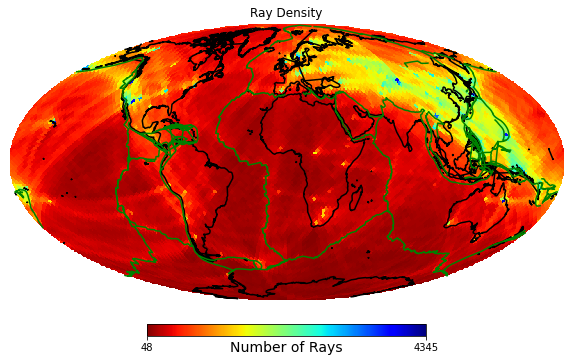

# Great Circle Path
A simple script to find [Healpix](https://healpy.readthedocs.io/en/latest/index.html) pixels along great circle paths.

## Installation
All dependencies mamaged by [poetry](https://python-poetry.org/)
```
cd GreatCirclePaths
poetry install
source .venv/bin/activate
```
Note for the last line, the location of the environment (in this case `.venv`) will depend on your poetry configuration.

Test the code with
```
pytest
```

## Usage
```
cd greatcirclepaths
python main.py <infile> <outfile> <options>
```
`<infile>` is a file path containing the latitude and longitude of the start and end points of the great circle paths, with columns 
> start_latitude,  start_longitude, end_latitude, end_longitude 

`<outfile>` is a file path where output will be saved as a `.npz` file.  Output is a `scipy.sparse` matrix, where each row is a HealPix map with 1s along the great circle path.

Run `python main.py --help` for further details.

This can be quite slow when picking many paths so we recommend using as many processes as possible.  Default is 4.

## Visulaisation
Manipulate the sparse matrix as you want and convert to a regular `numpy` array.  Then just use the [healpy visulaisation functions](https://healpy.readthedocs.io/en/latest/healpy_visu.html). For example
```
from matplotlib import cm
import numpy as np
import healpy as hp
from scipy import sparse

path_matrix = sparse.load_npz(<outfile>)
path_map = np.array(path_matrix.sum(axis=0))[0]
hp.mollview(path_map, filp="geo", cmap=cm.jet, title="Ray Density", unit="Number of Rays")
```


